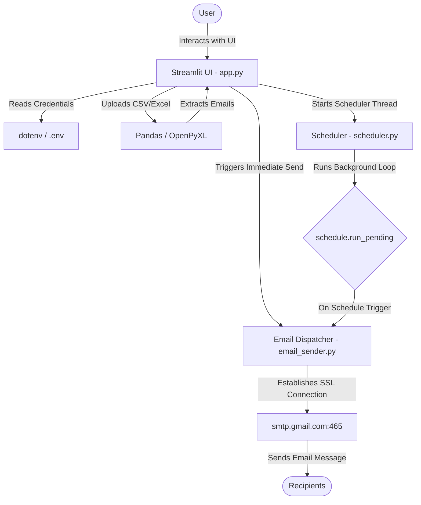

# 📧 Bulk Email Sender Pipeline

A production-grade, secure, and thread-safe Python bulk email automation pipeline featuring a real-time Streamlit dashboard, automated background scheduling, and robust SMTP mail dispatch.

---

## 📝 Overview

The **Bulk Email Sender Pipeline** is designed to streamline mass email communications safely and efficiently. By leveraging Python's lightweight daemon threading and the `schedule` library, it enables users to schedule daily email distributions at specified times without blocking the user interface. It parses recipient addresses directly from uploaded CSV or Excel files, validates formats on-the-fly, and transmits messages via secure Gmail SMTP SSL connections.

---

## ✨ Features

* **📥 File-Based Recipient Uploads**: Support for both CSV (`.csv`) and Excel (`.xlsx`) files.
* **✉️ Customizable Messaging**: Inputs for email subject lines and body copy directly in the web UI.
* **⏰ Automated Daily Scheduling**: Schedule automated dispatches at any 24-hour time slot (HH:MM).
* **⚡ On-Demand Testing**: Dispatch single test batches instantly before activating the daily schedule.
* **⚙️ Live Control Panel**: Side-panel dashboard displaying scheduler state, scheduled time, and total recipient count.
* **⏹️ Safe Scheduler Lifecycle**: Clean restart and shutdown controls backed by lock and event-driven thread safety.
* **🔐 Secure Credential Handling**: Auto-loading of sender address and app passwords from `.env` configuration.
* **🛠️ Resilient SMTP Pipeline**: Independent, per-recipient `EmailMessage` generation to prevent header pollution and recover gracefully from connection issues.

---

## 📸 Screenshots

> *Add application screenshots here to showcase your live interface.*
> 
> **How to capture screenshots:**
> 1. Launch the Streamlit application (`streamlit run app.py`).
> 2. Capture the main input dashboard and the sidebar status widget.
> 3. Save the images to a `/screenshots` folder and link them here using: ``.

---

## 🛠️ Tech Stack

| Layer | Technology | Description |
| :--- | :--- | :--- |
| **Frontend UI** | [Streamlit](https://streamlit.io/) | Interactive web UI for configuration and real-time monitoring. |
| **Backend Core** | [Python](https://www.python.org/) | Python 3.11 core execution environment. |
| **Scheduling Engine** | [Schedule](https://schedule.readthedocs.io/) | Job scheduling library for running periodic tasks. |
| **Email Service** | [Gmail SMTP](https://support.google.com/a/answer/176600) | Secure transmission over SSL on port 465. |
| **Data Processing** | [Pandas](https://pandas.pydata.org/) | Data manipulation library for processing recipient lists. |
| **File Parsing** | [OpenPyXL](https://openpyxl.readthedocs.io/) | Excel reader engine for `.xlsx` spreadsheets. |
| **Configuration** | [Python-Dotenv](https://pypi.org/project/python-dotenv/) | Environment variable loader for secure credentials. |

---

## 🏗️ Architecture

The application is structured into modular layers designed to separate concerns and ensure thread safety:



* **User Interface Layer (`app.py`)**: Renders forms, processes uploaded spreadsheets, and communicates with the scheduler.
* **Scheduler Layer (`scheduler.py`)**: Runs inside a background daemon thread. Manages job triggers, isolates schedulers per run, and handles safe shutdowns.
* **Email Dispatch Layer (`email_sender.py`)**: Handles SMTP connection pools, authenticates with credentials, validates email syntax, and builds/sends separate `EmailMessage` payloads.
* **Configuration Layer (`.env`)**: Safely stores API credentials out of source control.
* **File Processing Layer**: Reads tabular data using Pandas and parses spreadsheet XML metadata using OpenPyXL.

---

## 📂 Project Structure

```text
Email automation/
├── .env.example          # Sample environment configuration
├── .gitignore            # Git exclusion rules
├── LICENSE               # MIT License
├── README.md             # Project documentation
├── app.py                # Streamlit UI dashboard
├── email_sender.py       # Email dispatch logic
├── scheduler.py          # Background scheduling and thread management
└── requirements.txt      # Project dependencies list
```

---

## 🚀 Installation Guide

Follow these steps to set up and run the project locally:

### 1. Clone the Repository
```bash
git clone https://github.com/ujjwal200629/bulk-email-sender.git
cd bulk-email-sender
```

### 2. Set Up a Virtual Environment
```bash
python -m venv .venv
# On Windows (PowerShell/CMD)
.venv\Scripts\activate
# On Linux/macOS
source .venv/bin/activate
```

### 3. Install Dependencies
```bash
pip install -r requirements.txt
```

### 4. Configure Environment Variables
Copy the template `.env.example` file and create a `.env` file:
```bash
cp .env.example .env
```
Open `.env` and fill in your details:
```env
SENDER_EMAIL=your-email@gmail.com
GMAIL_APP_PASSWORD=your-gmail-app-password
```

### 5. Run the Application
```bash
streamlit run app.py
```
Open your browser to the local URL (usually **http://localhost:8501**).

---

## 🔑 Environment Variables

| Variable | Description | Example / Format |
| :--- | :--- | :--- |
| `SENDER_EMAIL` | The Gmail address sending the bulk emails. | `example@gmail.com` |
| `GMAIL_APP_PASSWORD` | The 16-character Gmail App Password. | `abcd efgh ijkl mnop` |

### How to Generate a Gmail App Password
To bypass Gmail's security blocks, you cannot use your regular password. Follow these steps to generate a secure App Password:
1. Go to your [Google Account Console](https://myaccount.google.com/).
2. Navigate to the **Security** tab.
3. Under *How you sign in to Google*, ensure **2-Step Verification** is turned **ON**.
4. Click on **2-Step Verification**, scroll to the bottom, and click on **App passwords**.
5. Enter a name for the app (e.g., `Bulk Email Sender`) and click **Create**.
6. Copy the displayed 16-character passcode and paste it into your `.env` file.

---

## 📖 Usage Guide

1. **Populate Credentials**: The text boxes in the UI will automatically load defaults from your `.env` file.
2. **Upload Recipient List**: Upload a `.csv` or `.xlsx` file. Ensure that all email addresses are located in the **first (leftmost) column** of the sheet.
3. **Draft Email**: Write the email subject and body text.
4. **Run a Test**: Click **"📤 Send Email NOW (Test)"** to immediately dispatch the bulk mail to all listed contacts.
5. **Set Schedule**: In the *Daily Send Time* input field, type a 24-hour time (e.g. `16:30` for 4:30 PM).
6. **Start Automation**: Click **"🚀 Start Daily Automation"**. The sidebar will transition to **🟢 Automation Active** and show your scheduling information.
7. **Stop Automation**: Open the control panel in the sidebar and click **"⏹️ Stop Automation"** to terminate the scheduler daemon safely.

---

## 🧵 Scheduler Workflow

The application implements strict thread safety to avoid resource leakage and double dispatches:
* **Unique Scheduler Instances**: Rather than relying on the shared global `schedule` module, each thread instantiates a local `schedule.Scheduler()` engine.
* **Mutex Lock (`threading.Lock`)**: Prevents race conditions when starting or stopping schedulers.
* **Stop Event Signal (`threading.Event`)**: When a user changes the daily time configuration or clicks "Stop", the active event triggers a `.set()`. The background loop catches the signal and exits cleanly, closing the daemon thread.
* **Re-run Protection**: Re-starting the daily automation automatically shuts down the old thread before spawning a new one.

---

## 🔒 Security Considerations

* **Secrets Management**: Credentials should never be committed to git. Ensure your `.env` file remains listed in `.gitignore`.
* **Credential Scope**: Google App Passwords bypass standard login checks but can be revoked individually at any time in your account settings.
* **Secure Channels**: The SMTP pipeline connects exclusively via SSL (`smtplib.SMTP_SSL`) to prevent man-in-the-middle credential interception.

---

## 🛡️ Error Handling

* **Invalid Emails**: Built-in regex matches verify standard email formatting. Malformed rows in spreadsheets are skipped automatically, preventing SMTP failures from interrupting valid recipients.
* **SMTP Failures**: The connection block is wrapped in a try-catch pattern. If Gmail is unreachable, or authentication fails, the application prints a failure status and records skipped messages instead of crashing the scheduler.
* **Spreadsheet Robustness**: Null lines or rows containing missing fields are safely bypassed.

---

## 🔮 Future Improvements

* **📈 Live Send Logs**: Create a logging container inside the Streamlit dashboard to show real-time transmission success per recipient.
* **📊 HTML Support**: Support rich HTML rendering for marketing emails.
* **📂 Custom Column Mapping**: Allow users to map which column in their uploaded sheet contains email addresses instead of forcing the first column.
* **🔄 Multiple Daily Triggers**: Enable scheduling multiple dispatch triggers throughout the day.

---

## 🤝 Contributing

Contributions are welcome! Please follow these steps to contribute:
1. Fork the Project.
2. Create a Feature Branch (`git checkout -b feature/AmazingFeature`).
3. Commit your changes (`git commit -m 'Add some AmazingFeature'`).
4. Push to the Branch (`git push origin feature/AmazingFeature`).
5. Open a Pull Request.

---

## 📄 License

Distributed under the MIT License. See [`LICENSE`](file:///d:/Email%20automation/LICENSE) for more information.

---

## ✍️ Author

**Ujjwal Dwivedi**
* GitHub: [@ujjwal200629](https://github.com/ujjwal200629)
